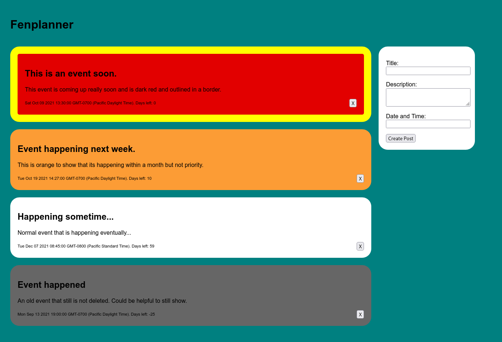

# Fenplanner


Fenplanner is a very basic web based planner that is the manifestation of an idea I've had for a long time. The events are displayed as a series of cards with the ones occuring sooner displayed in a more vibrant color.

It uses NodeJS, Express.js, and SQLite3 to work.

### To run

```
npm ci
node app.js
```

The application is then hosted by default at: [http://localhost:3000](http://localhost:3000)